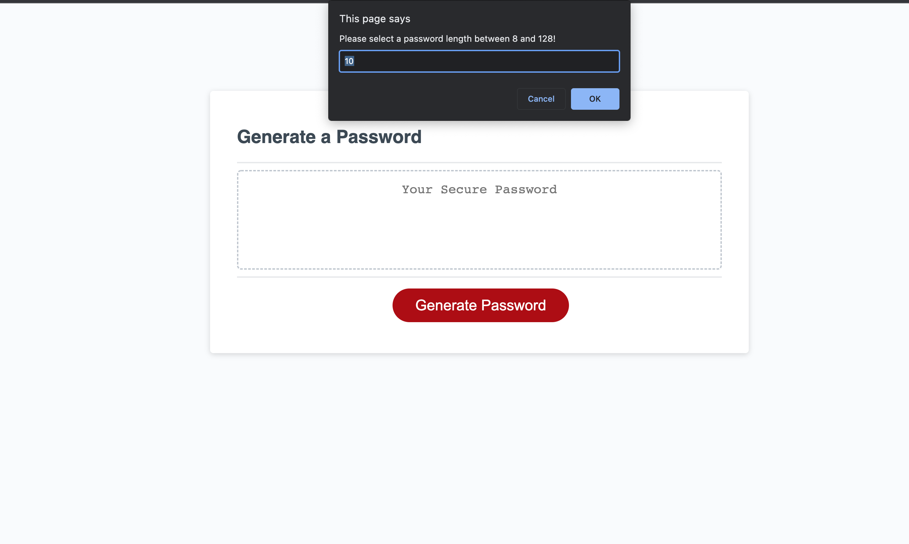

# Password Generator Starter Code
For this assignment, we needed to add functions within the Javascript for the Password Generator so it operated under specific parameters dictated by the User. 
We employed prompts to ensure proper length and the nature of the characters used, and loops to add characters until the parameters were met. Towards the end, I returned to revise the alert given when the password length was not within the proper range. I ultimately had to make sure that the password generator did not provide passwords under the incorrect parameters. 
 https://shadin-a.github.io/javascript-password-generator/
 
